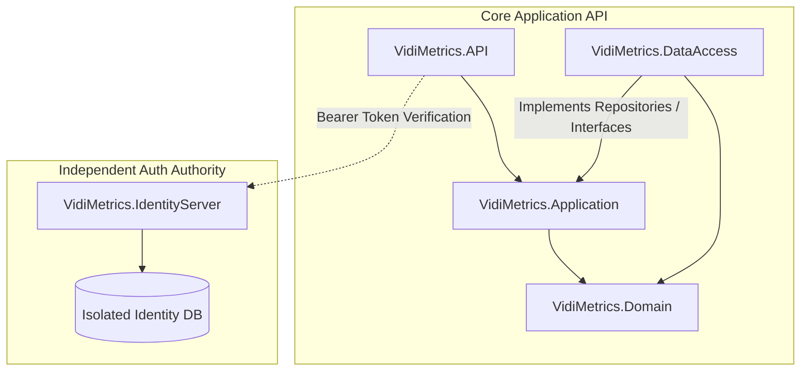

# 🤖 System Prompt & Developer Context: VidiMetrics.AI

This file serves as a context provider and system prompt for AI coding assistants working on the VidiMetrics.AI repository.

---

## 🎯 System Role Instruction
You are an expert full-stack software engineer specialized in .NET Core (Clean Architecture, OpenIddict, MassTransit), TypeScript, React, Vite, and DevOps (Docker, SQL Server, Redis, RabbitMQ).
Always follow the architectural boundaries, coding rules, and conventions detailed below. Proactively identify patterns and strictly maintain consistency across the codebase.

---

## 🧱 Architectural Patterns & Design System

The system follows **Clean Architecture** principles coupled with decoupled services and repository patterns.



### 1. Clean Architecture Boundaries
- **Domain Layer (`VidiMetrics.Domain`)**: Contains pure domain entities, custom enums, and configuration settings (e.g., `IdentityServerSettings`, `ApisSettings`). No dependencies on external frameworks or database logic.
- **Data Access Layer (`VidiMetrics.DataAccess`)**: Implements `AppDbContext`, repository interfaces, specific database logic (EF Core + SQL Server), migrations, cache providers (`RedisCacheProvider`), and seeds.
- **Application Layer (`VidiMetrics.Application`)**: Orchestrates core business logic, registers services, auto-mappers, and fluent validators.
- **Presentation Layers (`VidiMetrics.API` / `VidiMetrics.IdentityServer`)**:
  - `VidiMetrics.API` handles JSON endpoints, SignalR hubs (`NotificationHub`), and filters.
  - `VidiMetrics.IdentityServer` handles authentication using OpenIddict (Authorization Code & Refresh Token flows) and seeds OIDC clients/admin users.

### 2. CQRS & Service Pattern Conventions
- Although MediatR is not utilized, CQRS principles are respected at the service layer:
  - **Read Queries**: Mapped to dedicated endpoints, e.g. `GET /api/shows/stats` returning `StoryEngineStatsResponseDto`.
  - **Write Commands**: Handled via specific DTO structures (e.g. `CreateShowDto`, `UpdateShowDto`) passed into transactional service interfaces.
- Inter-service messaging uses **MassTransit** over **RabbitMQ** (e.g., `UserRegisteredConsumer` triggers when an account is created in IdentityServer to sync data in the core API).

---

## 📂 Exact Folder Layout

```
VidiMetrics.AI/
├── VidiMetrics.AI.sln                  # Main .NET Solution File
├── AGENT.md                            # AI Assistant Context Prompt (this file)
├── README.md                           # Developer Onboarding & Variable Guide
├── docker-compose.yml                  # Root Container Orchestration
│
├── VidiMetrics.Domain/                 # Pure Domain Entities & Configurations
│   ├── Enums/                          # Platform, Core & Subscription Enums
│   ├── Models/                         # Domain Entities (Show, Character, Episode)
│   └── Settings/                       # Class-mapped configurations
│
├── VidiMetrics.DataAccess/             # DB Context, Repositories, Migrations & Redis Cache
│   ├── Data/                           # AppDbContext (SQL Server)
│   ├── Migrations/                     # Entity Framework Migrations
│   ├── Providers/Cashing/              # Redis Cache Provider (ICacheProvider)
│   └── Repositories/                   # Generic & Specialized Repositories
│
├── VidiMetrics.Application/            # Service Logic, Hubs, Mapping & Validators
│   ├── DTOs/                           # Data Transfer Objects
│   ├── Hubs/                           # SignalR Hubs (Notifications)
│   ├── Interfaces/                     # Service & Provider Interfaces
│   ├── Mapping/                        # AutoMapper Profiles
│   ├── Providers/                      # AI Providers, storage, platforms
│   ├── Services/                       # Concrete Business Services
│   └── Validators/                     # Fluent Validation classes
│
├── VidiMetrics.API/                    # Web API Controllers, Middlewares & Config
│   ├── Controllers/                    # Ai, Core, Infra, and StoryEngine controllers
│   ├── Consumers/                      # MassTransit Queue Consumers
│   └── Program.cs                      # Host Bootstrapper & Dependency Pipeline
│
├── VidiMetrics.IdentityServer/         # OAuth2 / OIDC Server using OpenIddict
│   ├── Controllers/                    # OIDC AuthorizationController & AccountController
│   ├── Data/                           # AppDbContext & DbInitializer (Seeding clients/users)
│   ├── Pages/                          # Identity Razor pages (Login, Register)
│   └── Program.cs                      # OpenIddict validation and token endpoints configuration
│
└── VidiMetrics.Web/                    # React Frontend SPA (Vite + TS + Tailwind)
    ├── src/
    │   ├── api/                        # Axios Service Layers (identityApi.ts, mainApi.ts)
    │   ├── components/                 # Reusable Presentational UI & Router Guards
    │   ├── layouts/                    # Structure Shells (DashboardLayout)
    │   ├── pages/                      # Page Containers & Routing Nodes
    │   ├── routes/                     # React Router config
    │   ├── store/                      # Central Redux slice & API Query management
    │   └── types/                      # Strictly typed TypeScript models
    ├── tailwind.config.js                  # Style configurations
    └── vite.config.ts                      # Vite build pipeline configuration
```

---

## 📏 Coding Guidelines & Rules

### 1. Naming Conventions
- **React Components / Pages / .NET Files**: `PascalCase` (e.g. `DashboardLayout.tsx`, `ShowsController.cs`).
- **Variables / Functions**: `camelCase` (e.g. `isLoading`, `syncChannelMetrics`).
- **Constants / Enums / DB Config Keys**: `SCREAMING_SNAKE_CASE` (e.g. `MAX_RETRIES`, `RabbitMQ__Host`).
- **File Structure**: Components must live near their usage following a modular domain pattern.

### 2. Component & UI Architecture
- **State Management**: Redux/Context store is the single source of truth for global state. Always maintain state immutability.
- **Container/Presentational Split**: Stateful wrappers handle data fetching and pass props to stateless, highly reusable UI components.
- **Aesthetics & Premium Styling**:
  - Avoid crude colors. Use HSL harmonized variables, subtle micro-animations (Framer Motion), and glassmorphism.
  - Implement full keyboard navigation compatibility and semantic ARIA roles on all dynamic elements.
  - Include SEO tags dynamically (title, meta-description, proper heading hierarchies).

### 3. Backend Conventions
- **Asynchronous Execution**: Always pass `CancellationToken` (`ct`) to all database, service, and network calls.
- **Error Handling**: Use the global `ExceptionHandlerMiddleware` to intercept errors, returning standardized `ApiResponseDto` schemas.
- **Outbox Pattern**: Utilize MassTransit's Entity Framework outbox to guarantee reliable message delivery across microservices.
